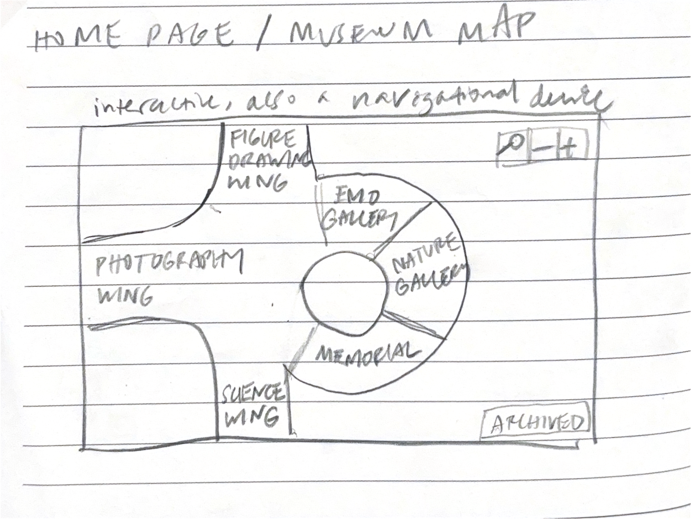
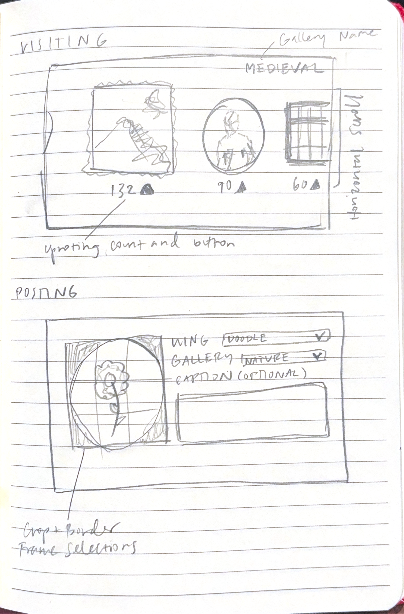

# E4

# Problem Framing

## Domain

Art, when mentioned in this assignment, is limited to traditional 2D static art such as drawings, paintings, and photographs. It excludes film, videos, performance, and interactive art. 

In the domain of art, there exist consumers and producers. Professional artists submit their work to auctions, fulfill commissions, or contribute to street art. Hobby artists gift their work to loved ones, publish it on their social medias, or keep their work private. Art consumers, those who notice and enjoy art, may view public art in the daily flow of their lives—local graffiti, landmark sculptures, art painted onto historical buildings such as churches, and murals. They also may actively search for art online—newsletters, Instagram, and Pinterest—and in person—museums, art fairs, and auctions. 

Museums are one of the most popular and structural ways that every day people are exposed to artwork. People go to museums for leisure, historical or artistic education, or inspiration for their own artwork. Contemporary artists typically aspire for their work to be displayed in museums for exposure and funding. Art curators are a kind of professional tier of art consumer; they select artwork for the museum to fulfill a number of factors: museum theme (natural, location, history, etc.), gallery description, quality of work, and the curator’s personal refined taste. 

## Bad Situations

1. It is difficult to encounter new art. 
    1. It’s easy to summon historic classic works through published digital archives, but to find new work, one would have to go to a contemporary museum. 
    2. IMPACT: If people aren’t encountering new art on a regular and low-effort basis, both creating and ingesting art feels further out of reach. The mental model of art becomes dated, and art feels progressively less important and timely. The only remaining artists and art consumers are insiders of the community, no longer casual people. The harm is that, through perceived alienation, the layperson loses out on the significant benefits of engaging in creative activity—self expression, cultural participation, stress reduction, and mental-health support**.**
2. People don’t know what art is truly resonating with people right now. 
    1. Museum work is curated by people with extensive art educations, digital art platforms are sales-driven, and social media algorithms push for short-form video content.  
    2. IMPACT: The cost is that we lose art as a genuine cultural mirror. When we study past eras and societies, historians typically look to their art to measure social and political climates, perceptions of daily life, etc. If popular art that are promoted are those that go viral on social media or sell for the most money, the art realm increasingly leans into those signals. The harm is downstream and irreversible; we are compiling a distorted archive of the present. Future historians will overfit analyses on art bought by wealthy people and maximized social media engagement.
    3. IMPACT: This lack of collective expression, reflection, and awareness affects in the present day as well. We lose the "structure of feeling," the shared but not-yet-articulated emotional texture of a moment that is felt before people are able to formalize them into ideas or ideologies. 

## Corroboration

It is difficult to encounter new art. 

- Art-exhibit attendance is dropping. It fell 8.6 points from 2017 to 2022, the largest drop of any arts category.
    - NEA, *Survey of Public Participation in the Arts (2022),* [https://www.arts.gov/impact/research/publications/arts-participation-2022-technical-summary-report](https://www.arts.gov/impact/research/publications/arts-participation-2022-technical-summary-report)
- Current accessible art channels exist for preserving old and canonical art, not new. art
    - Google Arts & Culture and museum open-access programs (Met, Europeana) encompass millions of pieces, but are disproportionately historic art.
- Perceived alienation.
    - The ****2017 Culture Track report via popular art platform Artsy found that "not for someone like me" was the top barrier to museum participation. 46% of non-participants cited it. 
    [https://www.artsy.net/article/artsy-editorial-37-art-museum-visitors-view-culture-takeaways-2017-culture-track-report](https://www.artsy.net/article/artsy-editorial-37-art-museum-visitors-view-culture-takeaways-2017-culture-track-report)
- Cause doubt: Social media creates a space for new art to emerge. Social feeds have the power to flood people with new art daily.

People don’t know what art is truly resonating with people right now. 

- The "structure of feeling".
    - Raymond Williams, *structure of feeling* (via The Long Revolution) wrote that art importantly expresses the shared, not-yet-articulated emotional texture of a moment.
- Cause doubt: Engagement metrics in social media are a genuine signal that reflect on the current cultural state.

## Workarounds and Comparables

- Social Media (Instagram, Pinterest, Facebook, Twitter)
    - People can make art accounts and post their work to a public feed. It has the potential to reach large audiences, but to intentionally do so, artists need to farm for engagement. As specified in Bad Situation #2, the engagement algorithm rewards provocative art, and not always an authentic cultural signal. The purpose of social media content is to entertain, which fundamentally misaligns with why people go to museums, for instance—to feel inspired, moved, and connected by art.
- Art sharing and selling platforms (Artsy, DeviantArt, etc.)
    - Artists promote and publish their work, and consumers can shop for art. This is a method to get a glimpse into contemporary art, but like social media, it doesn’t promote authenticity, but rewards marketability and resources. Popular art on these platforms are those that have commercial value and appear aesthetic as decor in a space. A one-off piece posted by an anonymous won’t gain any traction here just for being raw and relatable.

## Solution Sketch

- OVERVIEW: An online, publicly curated digital museum for contemporary art. It is free and accessible to all, and is explicitly not a social network or market place. There are no sales or profiles that you can follow.
- USER ROLES
    - Artists: anyone can post photos of their art into a certain genre or museum “wing” and optionally caption.
    - Visitors: anyone can upvote art that they resonate with for any reason.
- IDEAS
    - Wings/Galleries exist so that upvoted art can be celebrated for a diversity of characteristics. Some examples of wings can be “Relatability,” “Vulnerability,” “Technical Excellence,” “Worst Art” etc.
    - Limited seasons keep the art fresh. The rankings and wings change frequently—weekly and monthly—to encourage a constant flow of submissions and releases of exciting new categories.
- ADDRESSES BAD SITUATIONS
    - This creates a low-friction, ambient surface to encounter new work without being distracted by video content, advertisements, or flashy posts.
    - The community vote and lack of marketing and algorithms create an atmosphere where people are posting and viewing art for the sake of it. The absence of external motives makes space for a true reflection of the current cultural moment.

# Application Pitch

NAME: The Moment

MOTIVATION: It is difficult to encounter new art, and there is no sense of what art is truly resonating with the public right now. 

KEY FEATURES

The Moment is made up of users who may act as Artists and/or Visitors of a publicly-curated contemporary digital museum. Artists are anyone who posts their art, from a daily sketch to an evocative photograph. Visitors are any art enthusiasts who then scroll through posts, sorted by recency and votes, and upvote it if they resonate with it. Like a physical museum, the digital museum is divided into Wings and Galleries in order to organize the large collection of pieces and to celebrate popular art for a diversity of characteristics. To constantly promote fresh art and new categories, Seasons exist to limit the time a Wing or Gallery remains active for. 

# Concept Design

## Concept Specs

### concept Posting

**purpose** share content to a public forum to receive feedback from many other users

**principle** an author can create and delete a post

**state**

a set of Posts with

&emsp;&emsp;an owner User

&emsp;&emsp;content Content

**actions**

create (owner: User, Content) : return (Post)

&emsp;&emsp;**then** create a new post with this owner and content and return it

delete (User, Post)

&emsp;&emsp;**where** this post exists and this user is the owner of the post

&emsp;&emsp;**then** delete this post

### concept Upvoting

**purpose** rank items by popularity, prevents being overwhelmed with low quality items

**principle** Voters can upvote or downvote items that they approve or disapprove of, and then the items are ranked by their votes.

**state** 

a set of Votes with

&emsp;&emsp;a voter User

&emsp;&emsp;a target Item

**actions**

upvote (User, Item) : return (Vote)

&emsp;&emsp;**where** a vote with this user and item does not exist

&emsp;&emsp;**then** create a new vote with this user and item and return it

unvote (User, Item)

&emsp;&emsp;**where** a vote with this user and item exists

&emsp;&emsp;**then** delete the vote with this user and item

### concept Grouping

**purpose** organize items with shared characteristics to prevent being overwhelmed by many unrelated items

**principle** users create items, administrator users can create/delete groups, and users add/remove items to the groups

**state**

a set of Groups with

&emsp;&emsp;a name String

&emsp;&emsp;a set of Items

**actions**

create (User, name: String) : return (Group)

&emsp;&emsp;**where** the given user is an administrator and a group with this name doesn’t exist

&emsp;&emsp;**then** create a new Group with this name and an empty set of items then return it

delete (User, name: String)

&emsp;&emsp;**where** the given user is an administrator and a group with the given name exists

&emsp;&emsp;**then** delete the group with the given name

addItem (Group, Item)

&emsp;&emsp;**where** the group exists, the item exists, and the item is not already in this group

&emsp;&emsp;**then** add this item to this group

removeItem (Group, Item)

&emsp;&emsp;**where** the group exists, the item exists, and the item is in this group

&emsp;&emsp;**then** remove the item from this group

### concept Cycling

**purpose** regularly limit and fix the amount of time that items are active for

**principle** a cycle is defined as a fixed period of time. After it is initialized, the first cycle run occurs for the period of time, it ends, then immediately after, the next cycle run begins, and so on. Items are associated with each cycle run and are only active when its cycle run is happening.

**state**

a set of Cycles with

&emsp;&emsp;a start time DateTime

&emsp;&emsp;a period Time

&emsp;&emsp;a number of Runs

&emsp;&emsp;a set of Runs

a set of Runs with

&emsp;&emsp;a start time DateTime

&emsp;&emsp;an end time DateTime

&emsp;&emsp;a set of associated items Items

a set of Items with

&emsp;&emsp;an active Flag

&emsp;&emsp;some content Content

**actions**

create (period: Time, runs: Number) : return (Cycle)

&emsp;&emsp;**where** period is a valid time and number of runs is greater than 0

&emsp;&emsp;**then** create a new cycle with the start time set to now, given period, number of runs, and empty set of runs, then return it

delete (Cycle)

&emsp;&emsp;**then** delete the given cycle

createRuns (Cycle) : return (Cycle)

&emsp;&emsp;**where** the cycle’s number of runs is positive and the set of runs is empty

&emsp;&emsp;**then** create a run with the cycle’s start time, end time as the cycle’s period after the start time, and an empty set of associated items. If the number of runs is greater than 1, create the next run with the first cycle’s end time as its start time, and the period after this start time as its end time. Continue this process until the cycle has as many runs as its number of runs.

activate (Run)

&emsp;&emsp;**where** the current time is between the given run’s start time and end time

&emsp;&emsp;**then** make all items associated with this run active

deactivate (Run)

&emsp;&emsp;**where** the current time is not between the given run’s start time and end time

&emsp;&emsp;**then** make all items associated with this run inactive

addItem (Run, Item)

&emsp;&emsp;**where** the run and item exist, and the item is not already associated with this run

&emsp;&emsp;**then** add this item to the run

removeItem (Run, Item)

&emsp;&emsp;**where** the run and item exist, and the item is already associated with this run

&emsp;&emsp;**then** remove this item from the run

## Reactions

**reaction** gallery creation

**when** Requesting.createGallery (User, name: String, seasons: Number)

**then** Grouping.create(User, name); Cycling.create (galleryPeriod, seasons)

**reaction** post to gallery

**when** Requesting.postGallery (User, artwork, gallery: Group)

**then** Posting.create(User, artwork); addItem(gallery, artwork)

## Note

The Posting concept serves as the framework for artists to post their artwork to the public feed. Upvoting aligns directly with the upvoting feature that allows visitors to express whether a post has aligned with them. Grouping is the foundation of Wings and Galleries, as they simple organize artwork into more readable and convenient sections. The added benefit is that this promotes a diversity of art to be posted, but that is not core to the idea of grouping. Lastly, Cycling directly corresponds to the idea of Seasons in a museum, where every 6 months, for instance, a museum replaces its exhibitions with a new set.  

I’ve assumed a level of interdependence between concepts that isn’t explicit in reactions and states so as to not muddy the specification of each concept. For instance, in my application, the items that users can upvote are posts, but the idea of upvoting doesn’t require that the items are posts. 

Some more details to expand on: The authenticating, registering, and logging in concept is standard for this application to identify returning users. They are not core to the application’s purpose, so they are not included. The idea of an “administrator” is mentioned, and to begin with, that will simply be me, the singular developer of the platform. Finally, galleryPeriod is a hard coded constant decided by administrators as the fixed amount of time all galleries are active for. 

# UI Sketches

# User Journey

Sasha is a driven pre-med undergraduate student. Between studying for classes, researching at a hospital, and volunteering, she finds calm in the storm by sketching—people, landscapes, anything that feels important or beautiful. She’s not a professionally trained artist, but it’s always been a part of her life, and through practice, she has picked up decent technique and a distinct drawing style. 

She begins to feel comfortable with her pieces, then eventually, she begins to even feel proud of them. She sends them to family group chats and shows them to friends because she feels like they express a part of her that has felt incommunicable until now. She wants to know if anyone else feels this way, if anyone would appreciate her artwork in the way she does, and if anyone else lives this kind of double life. It’s rare to find people who weave art into their daily practice when they’re not career artists, or so it seems.

She begins on Instagram, as @sashas_art. After months of posting daily, she gains little traction, unable to compete for engagement among professional art businesses and influencers with millions of followers and brand deals. She doesn’t have the time or resources to figure out if her work is museum gallery material, but she knows it’s not unimportant. 

She searches on Reddit for a solution, and comes across The Moment. She creates an account, and unlike Instagram, her page isn’t flooded with popups about the newest engagement farming features: Business Analytics, Creator Insights, Promotions, etc. The idea of a profile doesn’t even exist. She is just one in a sea of artists. She first scrolls through galleries and wings that pique her interest: Figure Drawing and Watercolor Landscape. Her screen populates with art in familiar and entirely novel styles, all posted within the last week and sorted by upvotes. This isn’t anything like the pop culture works in MoMA or the Renaissance paintings in the MET. It’s simultaneously new, old, plain, and provocative. Invigorated by the idea that these pieces were posted by people no different than her, she begins posting photos of her own work. 

She feels freed from the shackles of engagement farming and market demand. She’s not looking to sell or go viral, but to simply share in this vibrant community of artists and enthusiasts. She’s unafraid of negative feedback because metrics only exist for uplifting resonant art. There are no comments or dislike buttons. So she posts her work every day to galleries that resonate with her. The figure drawing category is filled with quick sketches of people reading at parks, spouses cooking dinner, a parent laying down. In The Moment, she realizes that art is everywhere, being made by everyone, all the time. Sometimes she’s delighted to see that her drawings reach the top of the gallery, not necessarily the ones she has spent the most time on, but because she’s captured something special and human— the messiness of her boyfriend’s hair after he biked rapidly to see her or an embrace between her grandma and mom.